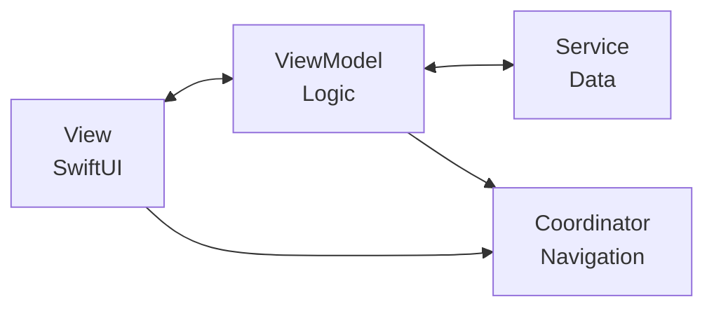

# iOS Banking App - MVVM-C Architecture Reference

A reference implementation of a SwiftUI banking application using the **MVVM-C** (Model-View-ViewModel-Coordinator) architecture pattern.

---

## Documentation

| Document | Description |
|----------|-------------|
| [Architecture Overview](readme/01-architecture-overview.md) | MVVM-C pattern, folder structure, component responsibilities |
| [Navigation Patterns](readme/02-navigation-patterns.md) | iOS 15 navigation, coordinators, deep linking |
| [Dependency Injection](readme/03-dependency-injection.md) | DI container, service layer, mock implementations |
| [Adding Features](readme/04-adding-features.md) | Step-by-step guide for implementing new features |
| [Architecture Decisions](readme/05-decisions.md) | ADRs explaining key design choices |
| [Code Conventions](readme/06-conventions.md) | Naming, patterns, logging, formatting |

---

## Tech Stack

| Component | Technology |
|-----------|------------|
| Platform | iOS 15.0+ |
| UI Framework | SwiftUI |
| Architecture | MVVM-C (Coordinator) |
| Reactive | Combine |
| Language | Swift 5.9 |
| Build System | Swift Package Manager |
| Logging | OSLog |
| Secure Storage | Keychain |
| Biometrics | LocalAuthentication |

---

## Features

### Completed (Epics 1-4)

- **Authentication**
  - Login with username/password
  - Biometric authentication (Face ID / Touch ID)
  - OTP verification
  - Session management
  - Forgot/Reset password

- **Accounts**
  - Account list with balances
  - Account detail view
  - Transaction history with pagination
  - Transaction detail
  - Statement download

- **Transfers**
  - Internal transfers (between own accounts)
  - External transfers (to beneficiaries)
  - Transfer confirmation with OTP
  - Transfer receipt

- **Beneficiary Management**
  - Beneficiary list
  - Add new beneficiary
  - Edit beneficiary
  - Delete beneficiary

### In Progress (Epics 5-6)

- Card management (list, detail, limits, block/unblock)
- Profile and settings
- Security settings
- Notification preferences

---

## Prerequisites

- Xcode 15.0+
- iOS 15.0+ Simulator or Device
- macOS Sonoma or later (recommended)

---

## Getting Started

### Clone & Open

```bash
git clone <repository-url>
cd mykuik-al-architectural-proposal
open Package.swift
```

### Build & Run

1. Open project in Xcode
2. Select iOS Simulator (iPhone 15 recommended)
3. Build and Run (Cmd + R)

### Test Credentials

| Username | Password |
|----------|----------|
| `user` | `password` |

OTP code for testing: `123456`

---

## Project Structure

```
mykuik-al-architectural-proposal/
├── Sources/
│   ├── App/                    # App entry point
│   ├── Router/                 # Routes & deep linking
│   ├── Coordinator/            # Navigation coordinators
│   ├── ViewFactory/            # View+ViewModel factories
│   ├── DI/                     # Dependency container
│   ├── Services/               # Service protocols & implementations
│   ├── Models/                 # Domain models
│   ├── ViewModels/             # Business logic
│   ├── Views/                  # SwiftUI views
│   └── Utilities/              # Logging, extensions
├── readme/                     # Developer documentation
│   ├── 01-architecture-overview.md
│   ├── 02-navigation-patterns.md
│   ├── 03-dependency-injection.md
│   ├── 04-adding-features.md
│   ├── 05-decisions.md
│   └── 06-conventions.md
└── Package.swift
```

---

## Architecture Highlights

### MVVM-C Pattern



### iOS 15 Navigation

Uses `NavigationView` with hidden `NavigationLink` pattern for programmatic navigation (NavigationStack requires iOS 16+).

**Constraints:**
- NO NavigationStack (iOS 16+)
- NO navigationDestination modifier (iOS 16+)
- USE NavigationView with `.navigationViewStyle(.stack)`
- USE `NavigationLink(destination:isActive:)` for programmatic navigation

### Deep Linking

Supports URL scheme `bankapp://` for navigation to any screen:
- `bankapp://accounts/ACC123`
- `bankapp://transfer/beneficiaries`
- `bankapp://cards/CARD456/settings`

---

## Key Files

| Purpose | File |
|---------|------|
| App Entry | `Sources/App/BankingApp.swift` |
| Root Coordinator | `Sources/Coordinator/AppCoordinator.swift` |
| Routes | `Sources/Router/Routes.swift` |
| DI Container | `Sources/DI/DependencyContainer.swift` |
| Example Coordinator | `Sources/Coordinator/Features/AccountsCoordinator.swift` |
| Example ViewModel | `Sources/ViewModels/Accounts/AccountDetailViewModel.swift` |

---

## Development

### Adding a New Feature

See [Adding Features Guide](readme/04-adding-features.md) for step-by-step instructions.

Quick checklist:
1. Define route enum in `Routes.swift`
2. Create/update coordinator
3. Create ViewFactory
4. Create ViewModel(s)
5. Create View(s)
6. Wire up deep links

### Conventions

- Use `Logger.{category}` for logging (never `print()`)
- Mask sensitive data (account numbers, card numbers)
- Always handle loading, error, and empty states
- Use `weak` for coordinator references in ViewModels

See [Code Conventions](readme/06-conventions.md) for full details.

---

## Architecture Decisions

Key decisions documented in [ADRs](readme/05-decisions.md):

| ADR | Decision |
|-----|----------|
| 001 | MVVM-C over VIPER/TCA |
| 002 | NavigationView for iOS 15 compatibility |
| 003 | Weak coordinator references |
| 004 | Mock services for POC phase |
| 005 | Combine over external state management |
| 006 | Per-feature coordinators |
| 007 | Type-safe routing |
| 008 | Lazy service initialization |
| 009 | OSLog for logging |

---

## Related Documentation

- [Product Requirements (PRD)](docs/prd.md)
- [Epic Breakdown](docs/epics.md)
- [Detailed Architecture](docs/architecture.md)
