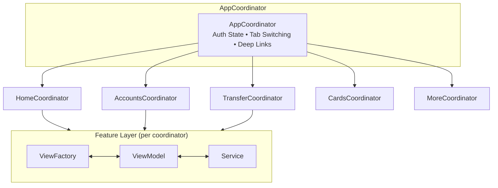
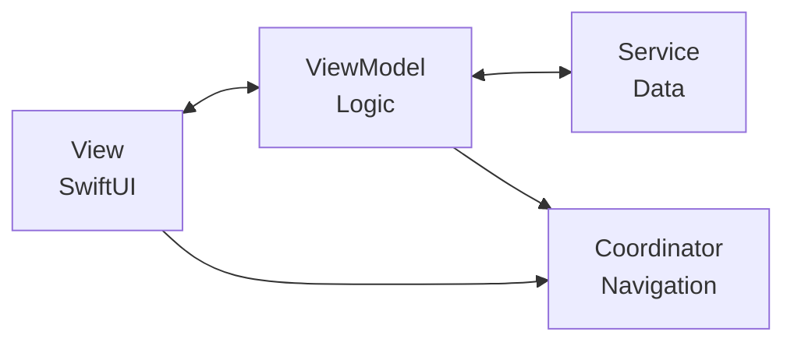
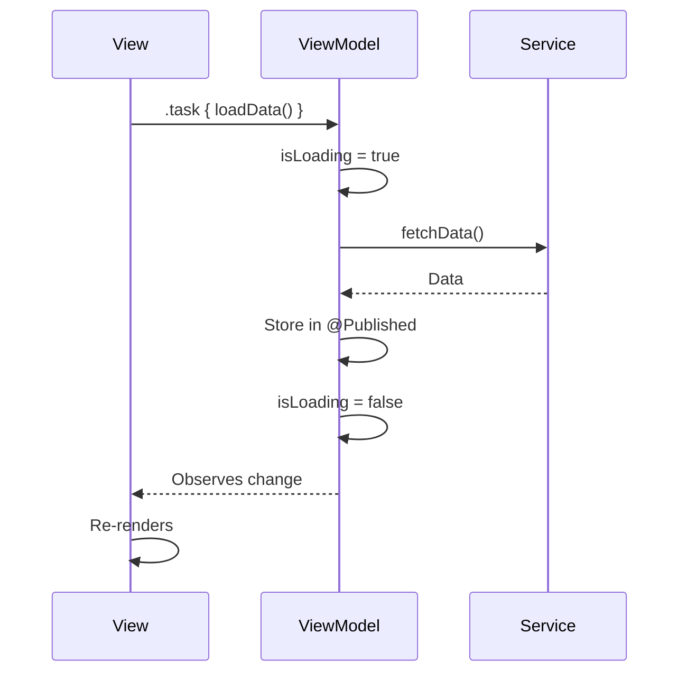
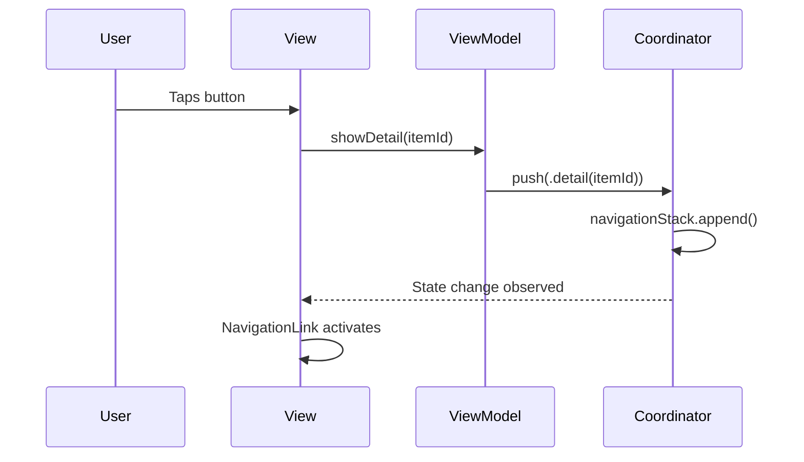
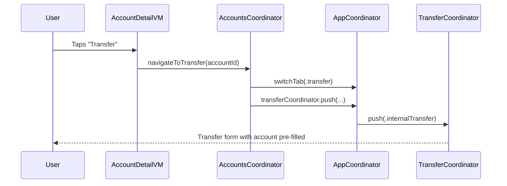
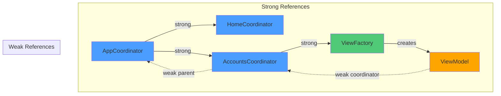

# Architecture Overview

This document provides a high-level overview of the iOS banking application architecture, including the MVVM-C pattern, folder structure, and component responsibilities.

---

## Architecture Pattern: MVVM-C

The application follows **MVVM-C** (Model-View-ViewModel-Coordinator), a variation of MVVM that extracts navigation logic into dedicated Coordinator objects.





---

## Layer Responsibilities

### Model
**Purpose:** Domain objects representing business entities.

**Location:** `Sources/Models/`

**Characteristics:**
- Pure data structures (structs)
- Codable for JSON serialization
- Hashable/Equatable for identity
- No business logic

**Examples:**
- `Account` - Bank account with balance, IBAN
- `Transaction` - Financial transaction record
- `Card` - Debit/credit card
- `Beneficiary` - Transfer recipient
- `User` - Authenticated user profile

---

### View
**Purpose:** SwiftUI views that render UI based on ViewModel state.

**Location:** `Sources/Views/{Feature}/`

**Characteristics:**
- Pure UI, no business logic
- Observes ViewModel via `@ObservedObject`
- Delegates user actions to ViewModel
- Handles all UI states (loading, content, error, empty)

**Pattern:**
```swift
struct AccountDetailView: View {
    @ObservedObject var viewModel: AccountDetailViewModel

    var body: some View {
        Group {
            if viewModel.isLoading { LoadingView() }
            else if let account = viewModel.account { content(account) }
            else if viewModel.error != nil { ErrorView(...) }
        }
        .task { await viewModel.loadData() }
        .refreshable { await viewModel.refresh() }
    }
}
```

---

### ViewModel
**Purpose:** Business logic, state management, and navigation delegation.

**Location:** `Sources/ViewModels/{Feature}/`

**Characteristics:**
- `ObservableObject` with `@Published` state properties
- Holds `weak` reference to Coordinator
- Async data loading with `@MainActor`
- Error handling and state management
- Delegates navigation to Coordinator

**Pattern:**
```swift
final class AccountDetailViewModel: ObservableObject {
    @Published var account: Account?
    @Published var isLoading = false
    @Published var error: Error?

    private let service: AccountServiceProtocol
    weak var coordinator: AccountsCoordinator?

    @MainActor
    func loadData() async {
        isLoading = true
        defer { isLoading = false }
        do {
            account = try await service.fetchAccount(id: accountId)
        } catch {
            self.error = error
        }
    }

    func showTransactions() {
        coordinator?.push(.transactions(accountId: accountId))
    }
}
```

---

### Coordinator
**Purpose:** Navigation orchestration and view construction.

**Location:** `Sources/Coordinator/{Feature}Coordinator.swift`

**Characteristics:**
- `ObservableObject` with `@Published` navigation state
- Owns ViewFactory for view construction
- Handles deep links
- Manages modals (sheet/fullscreen)
- Enables cross-feature navigation via parent

**Pattern:**
```swift
final class AccountsCoordinator: ObservableObject {
    @Published var navigationStack: [NavigationItem] = []
    @Published var presentedSheet: NavigationItem?

    private weak var parent: AppCoordinator?
    private let viewFactory: AccountsViewFactory

    func push(_ route: AccountsRoute) { ... }
    func pop() { ... }
    func present(_ route: AccountsRoute, fullScreen: Bool) { ... }
    func handle(deepLink route: AccountsRoute) { ... }

    @ViewBuilder
    func build(_ route: AccountsRoute) -> some View { ... }
}
```

---

### ViewFactory
**Purpose:** Creates View+ViewModel pairs with dependency injection.

**Location:** `Sources/ViewFactory/{Feature}ViewFactory.swift`

**Characteristics:**
- Receives DependencyContainer
- Creates ViewModels with injected services
- Optionally caches ViewModels for state preservation
- Provides coordinator reference to ViewModels

**Pattern:**
```swift
final class AccountsViewFactory {
    private let dependencyContainer: DependencyContainer

    func makeAccountDetailView(accountId: String, coordinator: AccountsCoordinator) -> some View {
        let viewModel = AccountDetailViewModel(
            accountId: accountId,
            accountService: dependencyContainer.accountService,
            transactionService: dependencyContainer.transactionService,
            coordinator: coordinator
        )
        return AccountDetailView(viewModel: viewModel)
    }
}
```

---

### Service
**Purpose:** Data access and business operations.

**Location:** `Sources/Services/Protocols/` and `Sources/Services/Implementations/`

**Characteristics:**
- Protocol-based for testability
- Async/await API
- Mock implementations for development
- Real implementations swap in via DependencyContainer

**Pattern:**
```swift
protocol AccountServiceProtocol {
    func fetchAccounts() async throws -> [Account]
    func fetchAccount(id: String) async throws -> Account
}

final class MockAccountService: AccountServiceProtocol {
    func fetchAccounts() async throws -> [Account] {
        try await Task.sleep(nanoseconds: 500_000_000)
        return mockAccounts
    }
}
```

---

## Folder Structure

```
mykuik-al-architectural-proposal/
├── Sources/
│   ├── App/
│   │   ├── BankingApp.swift        # @main entry point
│   │   ├── RootView.swift          # Auth gate + navigation
│   │   └── MainTabView.swift       # Tab bar container
│   │
│   ├── Router/
│   │   └── Routes.swift            # Route enums + DeepLinkParser
│   │
│   ├── Coordinator/
│   │   ├── CoordinatorProtocol.swift
│   │   ├── AppCoordinator.swift    # Root coordinator
│   │   └── Features/
│   │       ├── HomeCoordinator.swift
│   │       ├── AccountsCoordinator.swift
│   │       ├── TransferCoordinator.swift
│   │       ├── CardsCoordinator.swift
│   │       ├── MoreCoordinator.swift
│   │       └── AuthCoordinator.swift
│   │
│   ├── ViewFactory/
│   │   ├── HomeViewFactory.swift
│   │   ├── AccountsViewFactory.swift
│   │   ├── TransferViewFactory.swift
│   │   ├── CardsViewFactory.swift
│   │   ├── MoreViewFactory.swift
│   │   └── AuthViewFactory.swift
│   │
│   ├── DI/
│   │   └── DependencyContainer.swift
│   │
│   ├── Services/
│   │   ├── Protocols/
│   │   │   ├── AccountServiceProtocol.swift
│   │   │   ├── TransactionServiceProtocol.swift
│   │   │   ├── TransferServiceProtocol.swift
│   │   │   ├── CardServiceProtocol.swift
│   │   │   ├── AuthServiceProtocol.swift
│   │   │   └── ...
│   │   └── Implementations/
│   │       ├── MockAccountService.swift
│   │       ├── MockTransactionService.swift
│   │       ├── BiometricService.swift  # Real implementation
│   │       └── ...
│   │
│   ├── Models/
│   │   ├── Account.swift
│   │   ├── Transaction.swift
│   │   ├── Transfer.swift
│   │   ├── Card.swift
│   │   ├── Beneficiary.swift
│   │   ├── User.swift
│   │   ├── Auth.swift
│   │   └── Extensions.swift
│   │
│   ├── ViewModels/
│   │   ├── Home/
│   │   ├── Accounts/
│   │   ├── Transfer/
│   │   ├── Cards/
│   │   ├── More/
│   │   └── Auth/
│   │
│   ├── Views/
│   │   ├── Common/              # Reusable components
│   │   │   ├── LoadingView.swift
│   │   │   ├── ErrorView.swift
│   │   │   ├── EmptyStateView.swift
│   │   │   └── ...
│   │   ├── Home/
│   │   ├── Accounts/
│   │   ├── Transfer/
│   │   ├── Cards/
│   │   ├── More/
│   │   └── Auth/
│   │
│   └── Utilities/
│       └── AppLogger.swift
│
└── docs/
    └── readme/                  # This documentation
```

---

## Data Flow

### Loading Data



### Navigation



### Cross-Feature Navigation



---

## Memory Management

### Reference Graph



### Rules
1. **Parent references are WEAK**: Child coordinators hold weak ref to parent
2. **Coordinator references in ViewModels are WEAK**: Prevents retain cycles
3. **Use `[weak self]` in closures**: Especially in Combine sinks

---

## Key Concepts

### NavigationItem
Type-erased wrapper for routes in navigation stack:
```swift
struct NavigationItem: Identifiable, Equatable {
    let id: UUID
    let route: AnyHashable
}
```

### Route Protocol
All routes conform to:
```swift
protocol Route: Hashable, Identifiable {
    var id: String { get }    // Unique identifier
    var path: String { get }  // URL path for deep linking
}
```

### App Tabs
```swift
enum AppTab: String {
    case home
    case accounts
    case transfer
    case cards
    case more
}
```

---

## See Also

- [02-navigation-patterns.md](02-navigation-patterns.md) - iOS 15 navigation details
- [03-dependency-injection.md](03-dependency-injection.md) - Service layer and DI
- [04-adding-features.md](04-adding-features.md) - Step-by-step feature guide
- [05-decisions.md](05-decisions.md) - Architecture decision records
